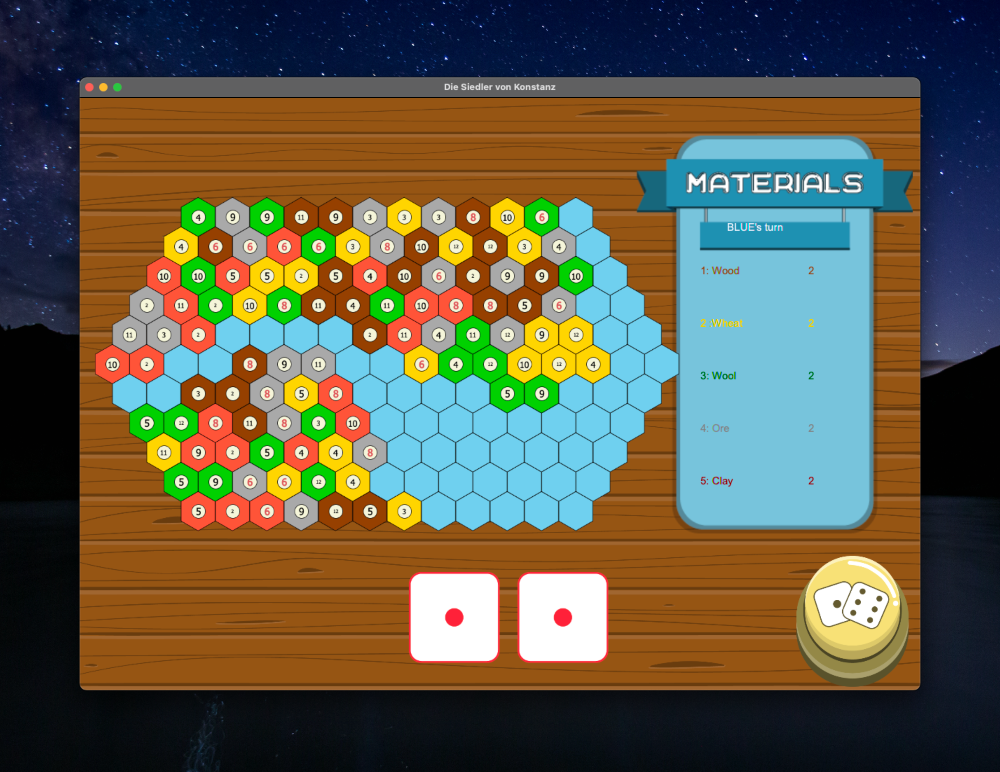

# UniGamesProject — "EotSC" (Example of the Software Crisis)

Spielesammlung in Java — Software-Projekt 2021, Gruppe 03, Universität Konstanz.

**Spiele:** Schach (Konsole + GUI, mit KI, Save/Load, Undo, Netzwerkmodus, Torpedo-Chess) ·
Skat (Konsole + GUI, mit KI, alle 3 Spielmodi) · Rummikub (GUI) ·
Die Siedler von Konstanz (GUI, mit KI, bis 12 Spieler) · 5× Tic Tac Toe (je Gruppenmitglied eins)



## Spielen ohne Java-Installation

Auf der [Releases-Seite](../../releases) gibt es fertige Pakete mit eingebauter Java-Runtime:

| System | Download | Start |
|---|---|---|
| Windows | `EotSC-windows-x64.msi` | Installieren, dann über das Startmenü starten (öffnet ein Konsolenfenster) |
| macOS (Apple Silicon) | `EotSC-macos-aarch64.zip` | Entpacken, Doppelklick auf `EotSC starten.command`¹ |
| macOS (Intel) | `EotSC-macos-x64.zip` | Entpacken, Doppelklick auf `EotSC starten.command`¹ |
| Linux | `EotSC-linux-x64.tar.gz` | Entpacken, `./eotsc.sh` |

¹ Beim ersten Start: Rechtsklick → „Öffnen", da das Paket nicht signiert ist.
Das Spielemenü läuft im Terminal, die Spiele öffnen eigene Fenster.

Alternativ liegen dort auch Fat-JARs pro Plattform — mit installiertem Java 17+ genügt:

```
java -jar EotSC-1.0.0-<plattform>.jar
```

Keine JavaFX-Installation, keine `--module-path`-Flags mehr nötig.

## Aus dem Quellcode starten

Einzige Voraussetzung: ein JDK 17 oder neuer (z. B. [Temurin](https://adoptium.net)).

```
git clone https://github.com/DennisRoemmich/UniGamesProject.git
cd UniGamesProject
./gradlew run          # Windows: gradlew.bat run
```

Gradle lädt JavaFX und alle Abhängigkeiten automatisch passend zum Betriebssystem
und zur CPU-Architektur herunter.

Weitere nützliche Befehle:

```
./gradlew shadowJar    # baut das Fat-JAR für die eigene Plattform (build/libs/)
./gradlew build        # kompiliert + baut
```

## Bedienung

Im Menü das Spiel per Tastatur wählen (Eingabe + ENTER):

| Eingabe | Spiel |
|---|---|
| `C` | Schach — danach `C` (Konsole) oder `G` (GUI) |
| `R` | Rummikub |
| `S` | Skat — danach `C` (Konsole) oder `G` (GUI) |
| `K` | Die Siedler von Konstanz |
| `T1`–`T5` | Tic Tac Toe (Barrios Herrera, de Boer, Kahabka, Römmich, Tietz) |

Die vollständige Anleitung mit Steuerung aller Spiele, Save/Replay-Details und
Feature-Liste: [docs/Anleitung_Gruppe03.md](docs/Anleitung_Gruppe03.md).
Das Game-Design-Dokument: [docs/gdd_gruppe03.pdf](docs/gdd_gruppe03.pdf).

## Projektstruktur

```
src/main/java/           gesamter Quellcode (ein Classpath, wie im Original-Release)
  menumain/              Startmenü (Einstiegspunkt: menumain.MenuMain)
  chess*/, engine/, npc/, network/, torpedo/   Schach
  gui*/, console/, controller/, javaFX/, main/ Skat (GUI- und Konsolenversion)
  rummikub*/             Rummikub
  siedler/, buildings/, cards/, map/, ...      Siedler von Konstanz
  game/, graphicalUI/, TicTacToeFX/, application/, tictactoe/, ...  Tic Tac Toes
  framework/             gemeinsames Spiel-Framework
src/main/resources/      FXML, Bilder, Sounds
src/main/resources-ttt/  "Resources/"-Baum (eigener Classpath-Eintrag, da macOS
                         "resources" und "Resources" nicht im selben Ordner erlaubt)
docs/                    Anleitung, Game-Design-Dokument, Screenshots
```

## Hintergrund

Das Projekt entstand 2021 als Uni-GitLab-Repo mit 36 Branches und wurde damals als
manuell in IntelliJ zusammengebautes 90-MB-Fat-JAR abgegeben, das JavaFX nur für
macOS/x86_64 enthielt und auf anderen Systemen ein manuell installiertes JavaFX-SDK
samt kryptischer Startflags brauchte. 2026 wurde der finale Quellstand aus den
damaligen Arbeitskopien rekonstruiert und auf diesen Gradle-Build umgestellt —
am Spielcode selbst wurde dabei nichts geändert. Details zur Rekonstruktion stehen
in [docs/BUILD_NOTES.md](docs/BUILD_NOTES.md).
